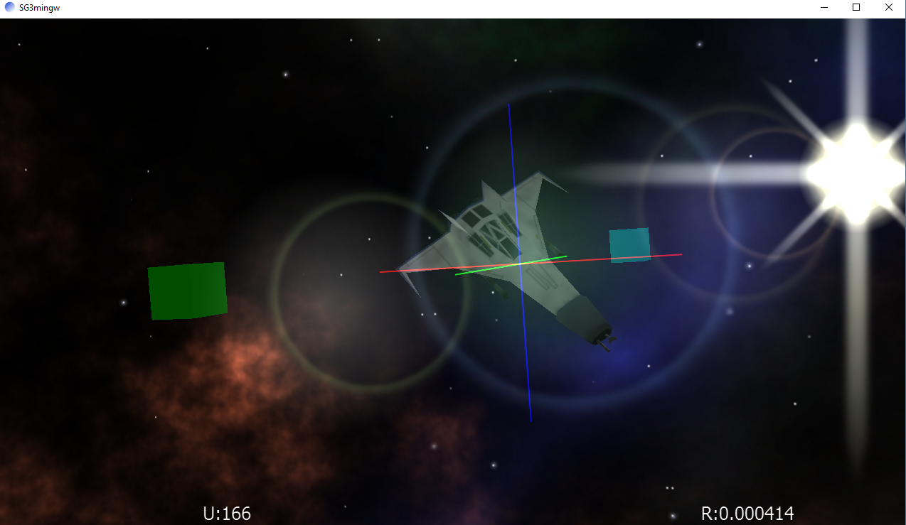

# sg3-legacy
Cross-platform pure C OpenGL 3D scene management library

This is an old project that provides OpenGL scene and object management functionality. The goal was to provide a native core graphics
library that would run on Windows, Linux, macOS, Android and iOS. It is written in C and provides compatibility wrappers around the
OpenGL APIs to account for platform differences.

The library includes:
* 3D math functions (written in C) - vectors, matrix manipulation, quaternians, etc.
* 3D model loading
* Camera positioning and manipulation
* 3D object management
* Skyboxes
* Lensflare effects
* 2D billboards
* HUD overlays (text images, shapes/lines, etc.)
